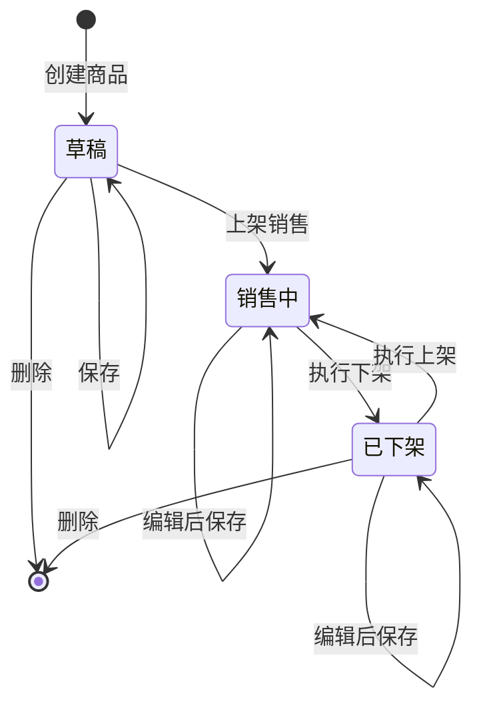

# 网上商城后台 - 商品管理模块产品需求文档 (PRD)

### **1. 项目概述**

#### **1.1. 项目背景**
为了支撑网上商城的正常运营，我们需要一个功能强大且易于使用的后台管理系统。商品管理是整个商城的核心，它直接影响到前端的商品展示、库存同步和销售流程。一个设计良好的商品管理模块能够极大地提升运营效率，确保商品信息的准确性。

#### **1.2. 产品目标**
* **核心目标：** 建立一套完整的商品信息管理流程，支持运营人员对商品（包括不同规格）进行高效、准确的创建、编辑、上架、下架等操作。
* **效率目标：** 简化操作流程，提供批量处理和快速搜索功能，减少运营人员的重复性劳动。
* **准确性目标：** 通过规范化的数据结构（SPU/SKU）和清晰的界面，确保商品价格、库存等关键信息的准确无误。

#### **1.3. 名词解释**
* **SPU (Standard Product Unit - 标准产品单元)：** 商品的标准化单位。例如，“越南芽庄沉香手串” 就是一个SPU。
* **SKU (Stock Keeping Unit - 库存量单位)：** 库存进出计量的基本单元，是SPU下的具体规格商品。例如，“越南芽庄沉香手串 8mm” 就是一个SKU。

### **2. 功能规划 (Roadmap)**

我们将分阶段进行开发，确保核心功能优先上线，快速投入使用。

* **一期 (MVP - 最小可行产品):**
    * 实现商品（SPU/SKU）的增删改查。
    * 实现商品分类的树形结构管理。
    * 实现基础的商品列表搜索和筛选。
    * **核心价值：** 确保运营人员能将商品完整地录入系统并上架销售。

* **二期 (优化迭代):**
    * 上线批量操作功能（如批量上/下架、批量修改分类）。
    * 增加材质、产地等属性的管理模块，方便筛选和维护。
    * 增加商品规格模板（如预设直径模板），提高录入效率。
    * 增加操作日志，追踪商品信息的变更历史。
    * **核心价值：** 提升运营效率，加强管理和追溯能力。

---

### **3. 一期 (MVP) 功能需求详述**

#### **3.1. 商品分类管理**
#### **3.1. 商品分类管理**

**用户故事:** 作为运营人员，我希望能以层级结构管理商品分类，以便于归类和查找不同类型的商品。

**功能描述:** 商品分类采用无限极树形结构，方便扩展。

**3.1.1. 分类列表**
* **界面展示：** 以树状表格（Tree Table）形式展示所有分类及其层级关系。
* **列表字段：** `分类名称`, `图标`, `排序`, `状态` (显示/隐藏), `操作` (添加子分类、编辑、删除)。
* **交互逻辑：** 支持展开/折叠子分类。

**3.1.2. 新增/编辑分类**
* **表单字段：** `上级分类`, `分类名称` (必填), `分类图标`, `排序`, `状态`。
* **校验规则：** 同一层级下，分类名称不可重复。

**3.1.3. 删除分类**
* **逻辑规则：**
    * 删除前应有二次确认弹窗。
    * **规则1：** 如果该分类下存在子分类，系统应提示“请先删除子分类”，操作失败。
    * **规则2：** 如果该分类（或其任何子分类）下已关联商品，系统应提示“该分类下存在商品，无法删除”，操作失败。
    * **设计目的：** 以上规则旨在确保所有商品都有明确的归属分类，避免出现数据不一致或“孤儿”商品。
---

#### **3.2. 商品管理 (SPU/SKU)**

**3.2.1. 商品列表页**
* **搜索/筛选区 (一期范围):**
    * **搜索框：** 支持 `商品名称` (模糊搜索), `商品ID` (精确搜索)。
    * **筛选条件：** `商品分类` (下拉树)、`商品状态` (下拉选择器：全部、草稿、销售中、已下架)。
* **列表字段 (SPU维度)：** `商品ID`, `商品主图`, `商品名称`, `所属分类`, `材质`, `价格范围`, `总库存`, `商品状态`, `创建时间`, `操作`。

**3.2.2. 新增/编辑商品页**
* **模块一：基本信息 (SPU信息)**：`商品名称`, `副标题`, `商品分类`, `主图`, `视频`。
* **模块二：商品属性 (核心业务字段)**：`材质` (必填), `产地`, `品级`。
* **模块三：规格信息 (SKU生成器)**：通过输入规格名（如：珠子直径）和规格值（如：8mm, 10mm）自动生成SKU列表。
* **模块四：SKU列表**：可编辑的表格，包含 `规格`, `图片`, `销售价`, `市场价`, `库存`, `SKU编码`, `状态`。
* **模块五：商品详情**：富文本编辑器。
* **模块六：物流及其它**：`固定运费`, `排序`。
* **表单操作按钮:**
    * `保存至草稿`：将当前所有信息保存，商品状态置为“草稿”。
    * `上架销售`：保存所有信息，并尝试将商品状态置为“销售中”。

---

#### **3.3. 核心机制定义**

**3.3.1. 商品状态流转机制 (State Machine)**
商品有三种核心状态：草稿 (Draft)、已下架 (Off-shelf)、销售中 (On-shelf)。

* **初始状态：** 所有新创建的商品，在首次保存后，状态默认为 **“草稿”**。
* **流转图：**


####   3.3.2. SKU规格的数据结构建议

在SKU表中，使用一个JSON类型的字段（如 specifications）来存储其规格键值对。

字段示例 (specifications):
```
[
  { "key": "珠子直径", "value": "8mm" },
  { "key": "款式", "value": "108颗" }
]
```
####  3.3.3. 列表衍生数据计算规则

价格范围 (Price Range): 取该SPU下，所有 状态为“启用” 的SKU的 销售价(price) 字段的 最小值 和 最大值。

总库存 (Total Stock): 计算该SPU下，所有 状态为“启用” 的SKU的 库存(stock) 字段的 总和。

####  4. 数据实体与关系定义

**4.1.1.核心实体说明**

运费模板： 一期简化为单个“固定运费”输入框。

商品与分类的关系: 一个商品（SPU）只能属于一个末级商品分类（多对一关系）。

**4.2. 实体关系图 (ERD)**
```
erDiagram
    PRODUCT_CATEGORY ||--o{ PRODUCT_SPU : "属于"
    PRODUCT_SPU ||--o{ PRODUCT_SKU : "包含"

    PRODUCT_CATEGORY {
        int id PK "分类ID"
        string name "分类名称"
        int parent_id FK "父分类ID"
    }

    PRODUCT_SPU {
        int id PK "商品SPU ID"
        string name "商品名称"
        int category_id FK "分类ID"
        string material "材质"
        string origin "产地"
        string grade "品级"
        string description "商品详情"
    }

    PRODUCT_SKU {
        int id PK "商品SKU ID"
        int spu_id FK "SPU ID"
        json specifications "规格描述"
        decimal price "销售价"
        int stock "库存"
    }
}
```
#### 5. 功能关系流程图

```
graph TD;
    A[运营人员登录后台] --> B{选择功能模块};
    B -- 商品分类管理 --> C[分类列表页];
    C --> D{操作: 增/删/改分类};
    D --> E[更新分类数据];

    B -- 商品管理 --> F[商品列表页];
    F --> G{操作: 搜索/筛选};
    F --> H{操作: 新增/编辑商品};
    F --> I{操作: 上/下架/删除};

    H --> J[进入商品编辑页];
    J --> K[步骤1: 选择商品分类];
    J --> L[步骤2: 填写SPU信息(含商品属性)];
    J --> M[步骤3: 定义规格 -> 生成SKU];
    J --> N[步骤4: 填写SKU价格/库存];
    J --> O[步骤5: 保存或上架];

    E -.->|数据依赖| K;

    I --> F;
    O --> F;
```