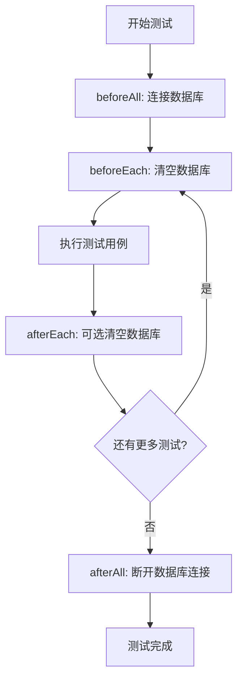

# 单元测试用例文档

## 重要说明

**接口响应规范**: 只要接口能正确调用，HTTP状态码都是200。业务处理错误主要通过业务码code来反馈，而不是使用HTTP状态码（如400、401、404等）。

## 概述

本文档描述了 mall-api 项目的单元测试用例，基于现有的接口功能和状态码设计。测试使用 Jest 框架，断言使用中文描述，测试数据使用本地 MongoDB 服务。

## 测试环境配置

### 测试框架和工具
- **测试框架**: Jest 30.0.0
- **断言库**: Jest内置断言，支持中文描述
- **测试运行器**: Jest CLI
- **数据库**: MongoDB 本地服务 (mall-api-test数据库)
- **测试类型**: 单元测试、集成测试

### 环境要求
- Node.js 18+
- MongoDB 6.0+ 本地运行
- npm 或 yarn 包管理器

### 配置文件
项目已配置以下测试配置文件：
- `package.json` - Jest基础配置
- `test/jest-e2e.json` - 端到端测试配置
- `.env.test` - 测试环境变量（需要创建）

## 测试文件结构

```
test/
├── setup/                    # 测试设置文件
│   ├── database.setup.ts    # 数据库连接配置
│   ├── fixtures/           # 测试数据夹具
│   │   ├── users.fixture.ts
│   │   ├── roles.fixture.ts
│   │   ├── permissions.fixture.ts
│   │   ├── menus.fixture.ts
│   │   ├── materials.fixture.ts
│   │   └── categories.fixture.ts
│   └── mocks/              # 模拟对象
│       ├── auth.mock.ts
│       ├── database.mock.ts
│       └── external-services.mock.ts
├── modules/                # 模块测试目录
│   ├── auth/              # 认证模块测试
│   │   ├── auth.controller.spec.ts
│   │   ├── auth.service.spec.ts
│   │   └── auth.guard.spec.ts
│   ├── user/              # 用户管理模块测试
│   │   ├── user.controller.spec.ts
│   │   ├── user.service.spec.ts
│   │   └── user.repository.spec.ts
│   ├── role/              # 角色管理模块测试
│   ├── permission/        # 权限管理模块测试
│   ├── menu/              # 菜单管理模块测试
│   ├── material/          # 材料管理模块测试
│   └── category/          # 分类管理模块测试
├── common/                # 通用功能测试
│   ├── pipes/
│   ├── guards/
│   ├── interceptors/
│   └── utils/
└── e2e/                   # 端到端测试
    ├── auth.e2e-spec.ts
    └── user.e2e-spec.ts
```

## 测试环境设置

### 1. 环境变量配置
创建 `.env.test` 文件用于测试环境：

```bash
# 数据库配置
DATABASE_URL=mongodb://localhost:27017/mall-api-test
DATABASE_NAME=mall-api-test

# JWT配置
JWT_SECRET=test-jwt-secret-key-for-unit-testing-only
JWT_EXPIRES_IN=1h

# 应用配置
NODE_ENV=test
PORT=3000
LOG_LEVEL=error

# 测试专用配置
TEST_TIMEOUT=30000
TEST_DB_CLEANUP=true
```

### 2. 数据库配置脚本
创建 `test/setup/database.setup.ts`：

```typescript
import { connect, connection, ConnectOptions } from 'mongoose';
import { config } from 'dotenv';

// 加载测试环境变量
config({ path: '.env.test' });

/**
 * 连接到测试数据库
 */
export const connectTestDB = async (): Promise<void> => {
  const dbUri = process.env.DATABASE_URL || 'mongodb://localhost:27017/mall-api-test';
  const options: ConnectOptions = {
    dbName: process.env.DATABASE_NAME || 'mall-api-test',
    maxPoolSize: 5,
    minPoolSize: 1,
    socketTimeoutMS: 30000,
    connectTimeoutMS: 10000,
  };

  try {
    await connect(dbUri, options);
    console.log('测试数据库连接成功');
  } catch (error) {
    console.error('测试数据库连接失败:', error);
    throw error;
  }
};

/**
 * 清空测试数据库
 */
export const clearTestDB = async (): Promise<void> => {
  const collections = connection.collections;
  
  for (const key in collections) {
    try {
      await collections[key].deleteMany({});
    } catch (error) {
      console.warn(`清空集合 ${key} 时出错:`, error);
    }
  }
};

/**
 * 断开数据库连接
 */
export const disconnectTestDB = async (): Promise<void> => {
  try {
    await connection.close();
    console.log('测试数据库连接已断开');
  } catch (error) {
    console.error('断开数据库连接时出错:', error);
    throw error;
  }
};

/**
 * 获取数据库连接状态
 */
export const getDBConnectionState = (): number => {
  return connection.readyState;
};
```

### 3. Jest全局设置
创建 `test/setup/jest.setup.ts`：

```typescript
import { connectTestDB, clearTestDB, disconnectTestDB } from './database.setup';

// 全局测试超时设置
jest.setTimeout(30000);

// 在所有测试之前运行
beforeAll(async () => {
  console.log('正在连接测试数据库...');
  await connectTestDB();
});

// 在每个测试之后运行
afterEach(async () => {
  if (process.env.TEST_DB_CLEANUP === 'true') {
    await clearTestDB();
  }
});

// 在所有测试之后运行
afterAll(async () => {
  console.log('正在断开测试数据库连接...');
  await disconnectTestDB();
});
```

## 测试执行流程

### 1. 测试生命周期


### 2. 测试执行步骤
1. **环境准备**: 确保MongoDB本地服务运行，端口27017
2. **安装依赖**: `npm install`
3. **设置环境**: 复制`.env.test`文件并配置测试数据库
4. **运行测试**: 执行相应的测试命令
5. **查看结果**: 检查测试输出和覆盖率报告

### 3. 测试数据准备策略

#### 3.1 测试数据夹具
创建 `test/setup/fixtures/users.fixture.ts`：

```typescript
import { Types } from 'mongoose';

export const testUsers = {
  adminUser: {
    _id: new Types.ObjectId(),
    username: 'admin',
    password: '$2b$10$ExampleHashedPassword', // bcrypt hash
    email: 'admin@example.com',
    phone: '13800138001',
    role: 'admin',
    status: 'active',
    createdAt: new Date(),
    updatedAt: new Date()
  },
  testUser: {
    _id: new Types.ObjectId(),
    username: 'testuser',
    password: '$2b$10$ExampleHashedPassword2',
    email: 'test@example.com',
    phone: '13800138000',
    role: 'user',
    status: 'active',
    createdAt: new Date(),
    updatedAt: new Date()
  },
  disabledUser: {
    _id: new Types.ObjectId(),
    username: 'disabled',
    password: '$2b$10$ExampleHashedPassword3',
    email: 'disabled@example.com',
    phone: '13800138002',
    role: 'user',
    status: 'disabled',
    createdAt: new Date(),
    updatedAt: new Date()
  }
};

export const createUserFixtures = async (userModel: any) => {
  await userModel.insertMany(Object.values(testUsers));
};
```

#### 3.2 测试数据工厂
创建 `test/setup/factories/user.factory.ts`：

```typescript
import { faker } from '@faker-js/faker';
import { Types } from 'mongoose';

export class UserFactory {
  static create(overrides: Partial<any> = {}) {
    return {
      _id: new Types.ObjectId(),
      username: faker.internet.userName(),
      password: faker.internet.password(),
      email: faker.internet.email(),
      phone: faker.phone.number(),
      role: 'user',
      status: 'active',
      createdAt: new Date(),
      updatedAt: new Date(),
      ...overrides
    };
  }

  static createMany(count: number, overrides: Partial<any> = {}) {
    return Array.from({ length: count }, () => this.create(overrides));
  }
}
```

## 测试命令和脚本

### 1. 基础测试命令
```bash
# 运行所有单元测试
npm test

# 运行测试并生成覆盖率报告
npm run test:cov

# 监视模式运行测试（开发时使用）
npm run test:watch

# 运行特定模块的测试
npm test -- --testNamePattern="认证模块"

# 运行包含特定描述的测试
npm test -- --testNamePattern="用户登录"

# 运行端到端测试
npm run test:e2e

# 调试测试
npm run test:debug
```

### 2. 测试覆盖率配置
在 `package.json` 中完善 Jest 配置：

```json
{
  "jest": {
    "moduleFileExtensions": ["js", "json", "ts"],
    "rootDir": "src",
    "testRegex": ".*\\.spec\\.ts$",
    "transform": {
      "^.+\\.(t|j)s$": "ts-jest"
    },
    "collectCoverageFrom": [
      "**/*.(t|j)s",
      "!**/*.d.ts",
      "!**/main.ts",
      "!**/node_modules/**",
      "!**/test/**",
      "!**/dist/**"
    ],
    "coverageDirectory": "../coverage",
    "testEnvironment": "node",
    "setupFilesAfterEnv": ["<rootDir>/../test/setup/jest.setup.ts"],
    "coverageThreshold": {
      "global": {
        "branches": 70,
        "functions": 80,
        "lines": 80,
        "statements": 80
      }
    },
    "coverageReporters": ["text", "lcov", "html"],
    "testTimeout": 30000
  }
}
```

### 3. 测试脚本示例
创建 `scripts/test-setup.js` 用于测试环境准备：

```javascript
#!/usr/bin/env node

const { execSync } = require('child_process');
const fs = require('fs');
const path = require('path');

// 检查MongoDB是否运行
function checkMongoDB() {
  try {
    execSync('mongosh --eval "db.adminCommand(\'ping\')"', { 
      stdio: 'pipe',
      timeout: 5000 
    });
    console.log('✅ MongoDB 服务正常运行');
    return true;
  } catch (error) {
    console.error('❌ MongoDB 服务未运行或无法连接');
    console.log('请运行: brew services start mongodb-community@6.0');
    return false;
  }
}

// 创建测试环境文件
function setupTestEnv() {
  const envExamplePath = path.join(__dirname, '..', '.env.example');
  const envTestPath = path.join(__dirname, '..', '.env.test');
  
  if (!fs.existsSync(envTestPath)) {
    if (fs.existsSync(envExamplePath)) {
      fs.copyFileSync(envExamplePath, envTestPath);
      console.log('✅ 已创建 .env.test 文件');
    } else {
      const testEnvContent = `
# 测试环境配置
DATABASE_URL=mongodb://localhost:27017/mall-api-test
JWT_SECRET=test-jwt-secret-key-for-unit-testing-only
NODE_ENV=test
PORT=3000
      `.trim();
      fs.writeFileSync(envTestPath, testEnvContent);
      console.log('✅ 已创建 .env.test 文件');
    }
  } else {
    console.log('✅ .env.test 文件已存在');
  }
}

// 主函数
function main() {
  console.log('🚀 正在设置测试环境...\n');
  
  // 检查MongoDB
  if (!checkMongoDB()) {
    process.exit(1);
  }
  
  // 设置环境文件
  setupTestEnv();
  
  console.log('\n✅ 测试环境设置完成！');
  console.log('运行以下命令开始测试:');
  console.log('  npm test        # 运行所有测试');
  console.log('  npm run test:cov # 运行测试并生成覆盖率报告');
}

// 执行
main();
```

### 4. 测试执行示例
```bash
# 第一次运行测试前的设置
chmod +x scripts/test-setup.js
node scripts/test-setup.js

# 运行特定测试模块
npm test -- --testPathPattern="src/modules/auth"

# 运行测试并输出详细结果
npm test -- --verbose

# 运行失败的测试
npm test -- --onlyFailures

# 生成HTML覆盖率报告
npm run test:cov && open coverage/index.html
```

## 测试最佳实践

### 1. 测试命名规范
```typescript
// 好的命名
describe('用户服务', () => {
  it('应该成功创建用户', () => {});
  it('重复用户名应该返回错误', () => {});
});

// 不好的命名  
describe('UserService', () => {
  it('test create user', () => {});
});
```

### 2. 断言最佳实践
```typescript
// 使用中文描述
expect(result).toEqual(expected);
// 断言: 期望结果等于预期值

expect(user.status).toBe('active');
// 断言: 期望用户状态为活跃

expect(() => service.createUser(invalidData)).toThrow(ValidationError);
// 断言: 期望使用无效数据创建用户时抛出验证错误

expect(console.error).toHaveBeenCalledWith('错误消息');
// 断言: 期望控制台输出错误消息
```

### 3. 测试隔离
- 每个测试应该独立运行
- 使用 beforeEach/afterEach 清理状态
- 避免测试之间的依赖关系

### 4. 性能考虑
- 测试运行时间应该合理
- 使用 mock 替代真实的外部服务
- 批量操作使用批量插入

## 故障排除

### 常见问题
1. **数据库连接失败**: 检查MongoDB服务是否运行
2. **测试超时**: 增加 jest.setTimeout 值
3. **环境变量未加载**: 确保 .env.test 文件存在
4. **端口冲突**: 修改测试用的端口号

### 调试技巧
```bash
# 调试特定测试
npm run test:debug -- --testNamePattern="用户登录"

# 查看详细日志
NODE_ENV=test DEBUG=* npm test

# 检查数据库状态
mongosh mall-api-test --eval "db.getCollectionNames()"
```

本文档提供了完整的测试环境设置、执行流程和最佳实践指南，确保单元测试能够顺利运行并覆盖所有核心功能。

## 应用启动和数据库连接测试用例

### 1. 应用启动测试

**测试场景**:
- 测试用例1: 应用应该能够正常启动并监听指定端口
- 测试用例2: 应用启动失败时应该正确抛出错误
- 测试用例3: 环境变量配置正确时应用应该正常启动

**断言**:
- 断言应用实例成功创建
- 断言端口监听正常
- 断言启动错误被正确捕获和处理

### 2. 数据库连接测试

**测试场景**:
- 测试用例1: 有效的MongoDB连接字符串应该成功连接数据库
- 测试用例2: 无效的MongoDB连接字符串应该抛出连接错误
- 测试用例3: 数据库连接超时应该正确处理
- 测试用例4: 数据库认证失败应该返回正确的错误信息

**断言**:
- 断言数据库连接成功时返回连接实例
- 断言连接错误时抛出正确的异常
- 断言连接状态正确反映数据库状态

### 3. 数据库连接重试机制测试

**测试场景**:
- 测试用例1: 连接失败时应该按照配置的重试次数进行重试
- 测试用例2: 重试间隔应该符合配置
- 测试用例3: 超过最大重试次数后应该抛出最终错误

**断言**:
- 断言重试机制按照配置执行
- 断言重试间隔正确
- 断言最终错误信息正确

### 4. 环境变量验证测试

**测试场景**:
- 测试用例1: 缺少必要的环境变量时应该抛出配置错误
- 测试用例2: 环境变量格式不正确时应该抛出验证错误
- 测试用例3: 默认环境变量值应该正确设置

**断言**:
- 断言环境变量验证正确
- 断言配置错误信息明确
- 断言默认值设置正确

## 配置数据格式

### 应用配置
```typescript
// 应用启动配置
const appConfig = {
  port: 3000,
  host: 'localhost',
  env: 'development',
  cors: {
    origin: ['http://localhost:3000'],
    credentials: true
  }
};

// 数据库连接配置  
const dbConfig = {
  uri: 'mongodb://localhost:27017/mall-api-test',
  options: {
    useNewUrlParser: true,
    useUnifiedTopology: true,
    connectTimeoutMS: 10000,
    socketTimeoutMS: 45000,
    maxPoolSize: 10,
    minPoolSize: 1,
    retryWrites: true,
    w: 'majority'
  },
  retry: {
    attempts: 3,
    delay: 1000
  }
};

// 环境变量要求
const requiredEnvVars = [
  'DATABASE_URL',
  'JWT_SECRET', 
  'NODE_ENV'
];
```

### 测试数据准备
```typescript
// 数据库连接测试数据
const testDbConnection = {
  validUri: 'mongodb://localhost:27017/test-db',
  invalidUri: 'mongodb://invalid-host:27017/test-db',
  timeoutUri: 'mongodb://slow-host:27017/test-db?connectTimeoutMS=100'
};

// 应用启动测试数据
const testAppConfig = {
  validPort: 3000,
  invalidPort: 99999,
  validHost: 'localhost',
  invalidHost: '256.256.256.256'
};
```

### 错误处理测试
```typescript
// 预期的错误消息
const expectedErrors = {
  dbConnection: '数据库连接失败',
  dbTimeout: '数据库连接超时',
  dbAuth: '数据库认证失败',
  appStart: '应用启动失败',
  envMissing: '缺少必要的环境变量'
};
```

## 认证模块测试用例

### 1. 用户登录接口测试

**接口**: POST /auth/login

**测试场景**:
- 测试用例1: 正确的用户名和密码应该返回成功状态（code: 200）和访问令牌
- 测试用例2: 错误的用户名应该返回认证错误（code: 2011）
- 测试用例3: 错误的密码应该返回认证错误（code: 2011）
- 测试用例4: 禁用的用户账户应该返回账户禁用错误（code: 2005）

**请求数据格式**:
```json
{
  "username": "string",
  "password": "string"
}
```

**响应数据格式**:
```json
{
  "access_token": "string",
}
```

**断言**:
- 断言登录成功时返回的响应包含access_token
- 断言登录失败时返回正确的错误码和错误信息

### 2. 获取用户资料接口测试

**接口**: GET /auth/profile

**测试场景**:
- 测试用例1: 有效的JWT令牌应该返回成功状态（code: 200）和用户信息
- 测试用例2: 无效的JWT令牌应该返回认证令牌无效错误（code: 2001）
- 测试用例3: 过期的JWT令牌应该返回认证令牌无效错误（code: 2001）

**请求数据格式**: 需要在请求头中包含有效的JWT令牌

**响应数据格式**:
```json
{
  "id": "string",
  "username": "string",
  "email": "string",
  "phone": "string",
  "role": "string",
  "status": "string",
  "createdAt": "string",
  "updatedAt": "string"
}
```

**断言**:
- 断言成功获取用户资料时返回完整的用户信息
- 断言认证失败时返回正确的错误信息

### 3. 修改密码接口测试

**接口**: POST /auth/password

**测试场景**:
- 测试用例1: 正确的当前密码和新密码应该返回成功状态（code: 200）
- 测试用例2: 错误的当前密码应该返回密码不匹配错误（code: 2013）
- 测试用例3: 新密码和确认密码不匹配应该返回验证失败错误（code: 9007）
- 测试用例4: 新密码与当前密码相同应该返回密码相同错误（code: 3014）

**请求数据格式**:
```json
{
  "currentPassword": "string",
  "newPassword": "string",
  "confirmPassword": "string"
}
```

**响应数据格式**:
```json
{
  "message": "string"
}
```

**断言**:
- 断言密码修改成功时返回成功消息
- 断言各种错误情况返回正确的错误码

## 用户管理模块测试用例

### 1. 获取用户列表接口测试

**接口**: GET /users/list

**测试场景**:
- 测试用例1: 有权限的用户应该返回成功状态（code: 200）和用户列表
- 测试用例2: 无权限的用户应该返回权限不足错误（code: 4006）
- 测试用例3: 分页参数测试应该返回正确的分页结果

**请求数据格式**: 可选的查询参数
```json
{
  "page": "number",
  "limit": "number",
  "search": "string"
}
```

**响应数据格式**:
```json
{
  "data": [
    {
      "id": "string",
      "username": "string",
      "email": "string",
      "phone": "string",
      "role": "string",
      "status": "string",
      "createdAt": "string"
    }
  ],
  "total": "number",
  "page": "number",
  "limit": "number"
}
```

**断言**:
- 断言返回的用户列表包含正确的字段
- 断言分页信息正确

### 2. 创建用户接口测试

**接口**: POST /users/create

**测试场景**:
- 测试用例1: 有效的用户数据应该返回成功状态（code: 200）
- 测试用例2: 重复的用户名应该返回用户已存在错误（code: 3001）
- 测试用例3: 重复的邮箱应该返回用户已存在错误（code: 3001）
- 测试用例4: 无效的用户数据应该返回验证失败错误（code: 9007）

**请求数据格式**:
```json
{
  "username": "string",
  "password": "string",
  "email": "string",
  "phone": "string",
  "role": "string"
}
```

**响应数据格式**:
```json
{
  "id": "string",
  "username": "string",
  "email": "string",
  "phone": "string",
  "role": "string",
  "createdAt": "string"
}
```

**断言**:
- 断言创建成功时返回创建的用户信息
- 断言重复数据时返回正确的错误信息

### 3. 更新用户接口测试

**接口**: POST /users/update

**测试场景**:
- 测试用例1: 有效的更新数据应该返回成功状态（code: 200）
- 测试用例2: 更新不存在的用户应该返回用户不存在错误（code: 3000）
- 测试用例3: 用户不能修改自己的角色和状态

**请求数据格式**:
```json
{
  "id": "string",
  "username": "string",
  "email": "string", 
  "phone": "string",
  "role": "string",
  "status": "string"
}
```

**响应数据格式**:
```json
{
  "id": "string",
  "username": "string",
  "email": "string",
  "phone": "string",
  "role": "string",
  "status": "string",
  "updatedAt": "string"
}
```

**断言**:
- 断言更新成功时返回更新后的用户信息
- 断言权限控制正确

### 4. 删除用户接口测试

**接口**: POST /users/delete

**测试场景**:
- 测试用例1: 删除存在的用户应该返回成功状态（code: 200）
- 测试用例2: 删除不存在的用户应该返回用户不存在错误（code: 3000）
- 测试用例3: 用户不能删除自己应该返回权限不足错误（code: 4006）

**请求数据格式**:
```json
{
  "id": "string"
}
```

**响应数据格式**:
```json
{
  "message": "string"
}
```

**断言**:
- 断言删除成功时返回成功消息
- 断言权限控制正确

## 角色管理模块测试用例

### 1. 创建角色接口测试

**接口**: POST /roles/create

**测试场景**:
- 测试用例1: 有效的角色数据应该返回成功状态（code: 200）
- 测试用例2: 重复的角色名称应该返回角色已存在错误（需要根据实际情况定义错误码）
- 测试用例3: 无效的角色数据应该返回验证失败错误（code: 9007）

**请求数据格式**:
```json
{
  "name": "string",
  "code": "string",
  "type": "string",
  "description": "string"
}
```

**响应数据格式**:
```json
{
  "id": "string",
  "name": "string",
  "code": "string",
  "type": "string",
  "description": "string",
  "createdAt": "string"
}
```

**断言**:
- 断言创建成功时返回创建的角色信息
- 断言角色类型一旦创建后不可修改

### 2. 获取角色列表接口测试

**接口**: GET /roles/list

**测试场景**:
- 测试用例1: 有权限的用户应该返回成功状态（code: 200）和角色列表
- 测试用例2: 无权限的用户应该返回权限不足错误（code: 4006）

**请求数据格式**: 无请求体，可选查询参数

**响应数据格式**:
```json
{
  "data": [
    {
      "id": "string",
      "name": "string",
      "code": "string",
      "type": "string",
      "description": "string",
      "createdAt": "string"
    }
  ]
}
```

**断言**:
- 断言返回的角色列表包含所有系统角色
- 断言权限控制正确

### 3. 更新角色权限接口测试

**接口**: POST /roles/update-permissions

**测试场景**:
- 测试用例1: 有效的权限更新应该返回成功状态（code: 200）
- 测试用例2: 更新不存在的角色应该返回角色不存在错误（code: 5000）
- 测试用例3: 无效的权限ID应该返回验证失败错误（code: 9007）

**请求数据格式**:
```json
{
  "roleId": "string",
  "permissionIds": ["string"]
}
```

**响应数据格式**:
```json
{
  "id": "string",
  "name": "string",
  "permissions": [
    {
      "id": "string",
      "name": "string",
      "code": "string"
    }
  ]
}
```

**断言**:
- 断言权限更新成功时返回更新后的角色信息
- 断言权限控制正确

## 权限管理模块测试用例

### 1. 创建权限接口测试

**接口**: POST /permissions/create

**测试场景**:
- 测试用例1: 有效的权限数据应该返回成功状态（code: 200）
- 测试用例2: 重复的权限代码应该返回权限已存在错误（code: 4007）
- 测试用例3: 无效的权限数据应该返回验证失败错误（code: 9007）

**请求数据格式**:
```json
{
  "name": "string",
  "code": "string",
  "type": "string",
  "description": "string"
}
```

**响应数据格式**:
```json
{
  "id": "string",
  "name": "string",
  "code": "string",
  "type": "string",
  "description": "string",
  "createdAt": "string"
}
```

**断言**:
- 断言创建成功时返回创建的权限信息
- 断言权限代码唯一性验证正确

### 2. 获取权限列表接口测试

**接口**: GET /permissions/list

**测试场景**:
- 测试用例1: 有权限的用户应该返回成功状态（code: 200）和权限列表
- 测试用例2: 按类型筛选权限应该返回正确的结果

**请求数据格式**: 可选查询参数 type="string"

**响应数据格式**:
```json
{
  "data": [
    {
      "id": "string",
      "name": "string",
      "code": "string",
      "type": "string",
      "description": "string"
    }
  ]
}
```

**断言**:
- 断言返回的权限列表包含所有权限类型
- 断言筛选功能正常工作

## 菜单管理模块测试用例

### 1. 获取菜单列表接口测试

**接口**: GET /menus

**测试场景**:
- 测试用例1: 不同角色的用户应该返回不同的菜单列表
- 测试用例2: 管理员角色应该返回所有菜单

**请求数据格式**: 需要在请求头中包含有效的JWT令牌

**响应数据格式**:
```json
[
  {
    "id": "string",
    "name": "string",
    "path": "string",
    "icon": "string",
    "children": [
      {
        "id": "string",
        "name": "string",
        "path": "string",
        "icon": "string"
      }
    ]
  }
]
```

**断言**:
- 断言菜单列表根据角色权限正确过滤
- 断言菜单层级结构正确

### 2. 创建菜单接口测试

**接口**: POST /menus/create

**测试场景**:
- 测试用例1: 有效的菜单数据应该返回成功状态（code: 200）
- 测试用例2: 重复的菜单路径应该返回菜单已存在错误（code: 7001）
- 测试用例3: 无效的父菜单ID应该返回验证失败错误（code: 9007）

**请求数据格式**:
```json
{
  "name": "string",
  "path": "string",
  "icon": "string",
  "parentId": "string",
  "order": "number"
}
```

**响应数据格式**:
```json
{
  "id": "string",
  "name": "string",
  "path": "string",
  "icon": "string",
  "parentId": "string",
  "order": "number",
  "createdAt": "string"
}
```

**断言**:
- 断言创建成功时返回创建的菜单信息
- 断言菜单层级验证正确

## 材料管理模块测试用例

### 1. 获取材料列表接口测试

**接口**: POST /material/list

**测试场景**:
- 测试用例1: 有效的查询参数应该返回code: 200和材料列表
- 测试用例2: 分页查询应该返回正确的分页结果
- 测试用例3: 按分类筛选应该返回正确的结果

**请求数据格式**:
```json
{
  "page": "number",
  "limit": "number",
  "categoryId": "string",
  "search": "string",
  "status": "string"
}
```

**响应数据格式**:
```json
{
  "data": [
    {
      "id": "string",
      "materialId": "string",
      "name": "string",
      "categoryId": "string",
      "categoryName": "string",
      "status": "string",
      "createdAt": "string"
    }
  ],
  "total": "number",
  "page": "number",
  "limit": "number"
}
```

**断言**:
- 断言返回的材料列表包含正确的字段
- 断言分页和筛选功能正常工作

### 2. 创建材料接口测试

**接口**: POST /material/create

**测试场景**:
- 测试用例1: 有效的材料数据应该返回code: 200
- 测试用例2: 重复的材料ID应该返回code: 1001（重复数据错误码）
- 测试用例3: 无效的分类ID应该返回code: 1002（数据验证错误码）

**请求数据格式**:
```json
{
  "materialId": "string",
  "name": "string",
  "categoryId": "string",
  "description": "string",
  "unit": "string",
  "price": "number",
  "stock": "number"
}
```

**响应数据格式**:
```json
{
  "id": "string"
}
```

**断言**:
- 断言创建成功时返回材料ID
- 断言数据验证正确

### 3. 更新材料接口测试

**接口**: POST /material/update

**测试场景**:
- 测试用例1: 有效的更新数据应该返回code: 200
- 测试用例2: 更新不存在的材料应该返回code: 1003（数据不存在错误码）
- 测试用例3: 并发更新应该正确处理

**请求数据格式**:
```json
{
  "id": "string",
  "materialId": "string",
  "name": "string",
  "categoryId": "string",
  "description": "string",
  "unit": "string",
  "price": "number",
  "stock": "number",
  "status": "string"
}
```

**响应数据格式**: 空响应体或成功消息

**断言**:
- 断言更新成功时不返回数据
- 断言错误处理正确

## 分类管理模块测试用例

### 1. 获取分类树接口测试

**接口**: GET /category/tree

**测试场景**:
- 测试用例1: 应该返回成功状态（code: 200）和完整的分类树结构
- 测试用例2: 分类树应该包含正确的层级关系

**请求数据格式**: 无请求体

**响应数据格式**:
```json
[
  {
    "id": "string",
    "name": "string",
    "code": "string",
    "children": [
      {
        "id": "string",
        "name": "string",
        "code": "string"
      }
    ]
  }
]
```

**断言**:
- 断言返回的分类树结构正确
- 断言父子关系正确维护

### 2. 创建分类接口测试

**接口**: POST /category/create

**测试场景**:
- 测试用例1: 有效的分类数据应该返回成功状态（code: 200）
- 测试用例2: 重复的分类名称应该返回分类已存在错误（code: 8001）
- 测试用例3: 无效的父分类ID应该返回验证失败错误（code: 9007）

**请求数据格式**:
```json
{
  "name": "string",
  "code": "string",
  "parentId": "string",
  "description": "string"
}
```

**响应数据格式**:
```json
{
  "id": "string"
}
```

**断言**:
- 断言创建成功时返回分类ID
- 断言分类层级验证正确

### 3. 移动分类接口测试

**接口**: POST /category/move

**测试场景**:
- 测试用例1: 有效的移动操作应该返回成功状态（code: 200）
- 测试用例2: 移动到自己的子分类应该返回分类不能移动到自身错误（code: 8007）
- 测试用例3: 移动后分类树结构应该正确更新

**请求数据格式**:
```json
{
  "categoryId": "string",
  "newParentId": "string"
}
```

**响应数据格式**: 空响应体或成功消息

**断言**:
- 断言移动操作成功
- 断言分类树结构正确维护

## 测试数据准备

### 通用测试数据
```typescript
// 测试用户数据
const testUser = {
  username: 'testuser',
  password: 'Test123!',
  email: 'test@example.com',
  phone: '13800138000'
};

// 测试角色数据
const testRole = {
  name: '测试角色',
  code: 'TEST_ROLE',
  type: 'CUSTOM'
};

// 测试权限数据  
const testPermission = {
  name: '测试权限',
  code: 'TEST_PERMISSION',
  type: 'API'
};

// 测试材料数据
const testMaterial = {
  materialId: 'TEST001',
  name: '测试材料',
  categoryId: 'valid-category-id'
};

// 测试分类数据
const testCategory = {
  name: '测试分类',
  code: 'TEST_CATEGORY'
};

// 测试菜单数据
const testMenu = {
  name: '测试菜单',
  path: '/test-menu',
  icon: 'test-icon',
  parentId: null,
  order: 1
};

const testSubMenu = {
  name: '测试子菜单', 
  path: '/test-menu/sub',
  icon: 'sub-icon',
  parentId: 'valid-parent-menu-id',
  order: 1
};
```

### 数据库初始化脚本
每个测试套件运行前应该:
1. 清空相关集合
2. 插入基础测试数据
3. 设置测试环境

## 测试执行命令

```bash
# 运行所有测试
npm test

# 运行特定模块测试
npm test -- --testNamePattern="认证模块"

# 生成测试覆盖率报告
npm run test:cov

# 监视模式运行测试
npm run test:watch
```

## 注意事项

1. 所有测试应该使用独立的测试数据库
2. 测试完成后应该清理测试数据
3. 模拟外部依赖（如邮件服务、短信服务）
4. 使用适当的测试隔离策略
5. 断言消息使用中文描述