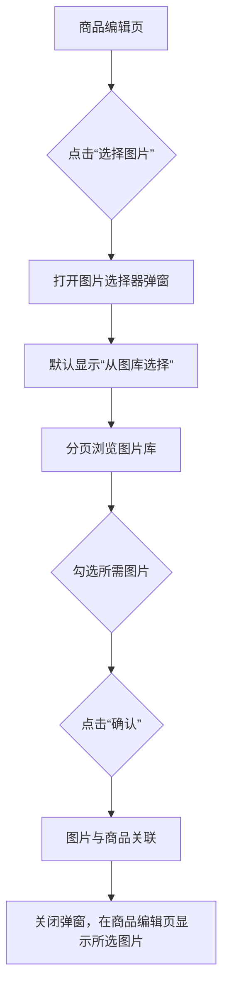

# 产品需求文档 (PRD): 图片管理功能

---

## 0. 文档说明

### 0.1. 目的
本规范旨在统一产品需求文档（PRD）的撰写标准，提升文档质量和可读性。通过结构化、标准化的文档，促进产品、研发、测试、设计等团队间的沟通效率，确保各方对需求有清晰、一致的理解，从而保障产品能够高质量、高效率地交付。

### 0.2. 核心原则
- **用户中心**： 始终围绕用户故事和用户价值来描述需求。
- **清晰准确**： 杜绝模棱两可的描述，确保每一项功能点、业务规则都清晰明确。
- **可视化优先**： 善用图表（流程图、状态图、ER图等）和原型链接，一图胜千言。
- **说明“为什么”**： 不仅要描述“做什么”，更要解释“为什么这么做”（业务价值、用户价值），帮助团队更好地理解需求本质。
- **完整性**： 覆盖正常流程、异常流程、边界条件和非功能性需求。

---

## 1. 项目概述

### 1.1. 项目背景与价值
随着商城业务的发展，商品数量和相关图片素材日益增多。当前，商品图片的管理方式分散，缺乏统一的存储和调用机制，导致运营人员在上传和维护商品图片时效率低下，且难以复用现有图片资源。

为了解决这一痛点，我们计划构建一个集中式的图片管理功能。该功能将提供一个统一的图片库，支持图片的上传、浏览、选择和复用，并为商品详情页提供便捷的图片管理能力（如排序、设置主图）。这将极大提升商品管理的效率，保证图片素材的一致性，并优化运营人员的工作体验。

### 1.2. 产品目标
- **核心目标**:
  - 构建一个标准化的图片选择器组件，作为图片管理的统一入口。
  - 实现图片库的统一管理，支持分页、排序、上传和多选功能。
  - 实现商品已选图片的精细化管理，包括拖拽排序、设置主图和移除。
- **效率目标**:
  - 提升商品图片上传和管理的效率 50% 以上。
  - 降低重复上传图片的概率，节省存储资源。
- **用户体验目标**:
  - 提供流畅、直观的图片管理交互体验。
  - 在上传、加载等耗时操作中提供清晰的状态反馈，减少用户等待焦虑。

### 1.3. 核心概念与名词解释 (Glossary)
- **图片库 (Image Gallery)**: 一个集中存储和管理所有上传图片的虚拟空间。
- **图片选择器 (Image Selector)**: 一个标准化的弹窗组件，集成了图片库浏览、图片上传和图片选择的功能。
- **主图 (Main Image)**: 商品的首要展示图片，通常用于商品列表页的缩略图。
- **商品图片 (Product Image)**: 与特定商品关联的图片，用于在商品详情页展示。

---

## 2. 功能规划 (Roadmap)
本项目作为一期整体交付，不分阶段。

---

## 3. 功能需求详述

### 3.1. 图片管理核心模块

#### 3.1.1. 用户故事 (User Story)
- **作为一名商品运营人员**，我希望能在一个统一的界面中看到所有已上传的图片，以便于我快速查找和复用它们。
- **作为一名商品运营人员**，我希望能从本地批量上传新图片到图片库，以便于我高效地补充图片素材。
- **作为一名商品运营人员**，我希望能一次性从图片库中勾选多张图片，并将其关联到正在编辑的商品，以简化操作步骤。
- **作为一名商品运营人员**，我希望能通过拖拽来调整商品已选图片的顺序，以便于我控制它们在前台的展示效果。
- **作为一名商品运营人员**，我希望能轻松地将某张图片设置为商品主图，以便于突出核心卖点。
- **作为一名商品运营人员**，我希望能将不再需要的图片从商品中移除，同时保留它在图片库中，以便于其他商品将来还能使用。

#### 3.1.2. 功能描述
图片管理功能主要由两部分组成：
1.  **图片选择器弹窗**：作为核心交互界面，在需要选择图片的地方（如商品编辑页）被调用。它内部包含了“图片库”和“上传新图片”两个功能区。
2.  **商品已选图片列表**：在商品编辑页，用于展示和管理已与该商品关联的图片。

#### 3.1.3. 界面设计与交互逻辑
**1. 图片选择器弹窗**
- **触发方式**: 在商品编辑页点击“选择图片”或“添加图片”按钮后，以弹窗形式打开。
- **界面布局**:
  - 顶部为功能切换区，包含“从图库选择”和“上传新图片”两个标签页。
  - 中间为主要内容区，根据所选标签页展示图片库列表或上传界面。
  - 底部为操作区，包含“确认”和“取消”按钮。
- **“从图库选择”标签页**:
  - **界面元素**:
    - 图片列表：以网格（Grid）形式展示图片，默认按上传时间倒序排列。
    - 分页控件：在列表底部，用于浏览更多图片。
    - 图片卡片：每张图片为一个卡片，鼠标悬浮时显示勾选框。
  - **交互逻辑**:
    - 点击图片卡片或其上的勾选框，即可选中或取消选中该图片。
    - 选中的图片会有明显的视觉标识（如边框高亮、出现角标）。
    - 弹窗底部或顶部应实时显示已选中的图片数量。
    - 点击“确认”按钮，将所有选中的图片信息返回给商品编辑页，并关闭弹窗。
- **“上传新图片”标签页**:
  - **界面元素**:
    - 上传区域：支持点击选择文件或拖拽文件到此区域。
    - 上传按钮。
    - 上传进度列表：显示正在上传的每个文件的进度条、文件名和状态。
  - **交互逻辑**:
    - 用户选择或拖拽图片文件后，立即开始上传。
    - 列表实时显示上传进度。上传成功后，状态变为“上传成功”。
    - 所有上传成功的图片，将自动被添加到图片库中，并切换到“从图库选择”标签页，同时这些新图片默认处于选中状态。

**2. 商品已选图片管理**
- **界面元素**:
  - 在商品编辑页，以列表或网格形式展示已为该商品选择的图片。
  - 每张图片卡片上应包含：
    - 图片缩略图。
    - “设为主图”按钮/链接。
    - “移除”按钮。
    - 如果某张图已是主图，应有“主图”标识。
- **交互逻辑**:
  - **拖拽排序**: 用户可以按住图片卡片并拖动，以调整图片间的顺序。
  - **设为主图**: 点击“设为主图”按钮，该图片右上角显示“主图”标识，原主图的标识自动取消。
  - **移除**: 点击“移除”按钮，弹出二次确认框。确认后，该图片从当前商品已选列表中消失。

#### 3.1.4. 业务规则与逻辑详述
- **上传规则 (基于 Supabase)**:
  - **客户端发起**: 图片上传流程由前端发起。前端向后端请求一个有时效性的上传凭证（Signed URL）。
  - **后端生成凭证**: 后端接收到请求后，调用 Supabase 服务端 SDK，为即将上传的文件生成一个预签名的上传 URL，并将其返回给前端。
  - **客户端直传**: 前端使用获取到的预签名 URL，将图片文件直接上传到 Supabase Storage。
  - **数据入库**: 前端上传成功后，将 Supabase 返回的图片公网 URL 发送给后端。后端将该 URL 及相关信息（如文件名、大小等）存入本地数据库的 `IMAGE` 表中。
  - **格式与大小限制**: 文件类型 (`JPEG, PNG, GIF`) 和大小 (`不超过 5MB`) 的校验将在前端和后端生成凭证时双重进行。
- **选择规则**:
  - 支持多选。
  - 每次打开图片选择器时，应高亮显示当前商品已经选择的图片。
- **管理规则**:
  - 每个商品必须至少有1张图片，但可以没有主图。
  - 每个商品最多只能有1张主图。
  - 从商品中“移除”图片，只是解除商品与图片的关联，并不会从图片库中删除该图片。
- **状态反馈**:
  - 图片库加载时，应有 Loading 提示。
  - 图片库为空时，应有空状态提示，并引导用户上传图片。
  - 上传过程中，必须显示清晰的进度条。上传失败时，要给出明确的失败原因。

---

## 4. 技术实现方案与全局规则

### 4.1. 图片存储方案 - Supabase Storage
- **选型理由**: Supabase 提供了开箱即用的对象存储服务（Storage），并与数据库、认证等功能深度集成。它简化了文件上传和管理的流程，特别是其服务端生成预签名 URL 的功能，可以实现客户端安全直传，减轻了我们后端服务器的带宽和处理压力。
- **上传流程**:
  1.  **客户端**: 用户选择图片后，向 NestJS 后端发起一个 `GET /image/upload-token` 请求，参数可包含文件名、文件类型等。
  2.  **服务端 (NestJS)**: 收到请求后，使用 Supabase Admin SDK 的 `createSignedUploadUrl` 方法，在指定的存储桶（Bucket）和路径下创建一个有时效性（如 60 秒）的预签名上传 URL。
  3.  **服务端 (NestJS)**: 将生成的 `signedUrl` 和 `path` 返回给客户端。
  4.  **客户端**: 使用获取到的 `signedUrl`，以 `PUT` 或 `POST` 请求，将文件二进制内容作为请求体，直接上传到 Supabase Storage。
  5.  **客户端**: 上传成功后，客户端根据返回的 `path` 和 Supabase 的公网 URL 规则拼接出完整的图片 `publicUrl`。
  6.  **客户端**: 调用后端的 `POST /image/create` 接口，将 `publicUrl` 和其他元数据提交。
  7.  **服务端 (NestJS)**: 将图片信息存入数据库的 `IMAGE` 表中，完成整个流程。

---

## 5. 数据模型设计

### 5.1. 实体关系图 (ERD)
使用 Mermaid 语法绘制核心实体关系。

```mermaid
erDiagram
    PRODUCT ||--o{ PRODUCT_IMAGE : "has"
    IMAGE ||--o{ PRODUCT_IMAGE : "is used in"

    PRODUCT {
        int id PK "商品ID"
        string name "商品名称"
        --
    }

    IMAGE {
        int id PK "图片ID"
        string url "图片公网URL (Supabase)"
        string path "图片在Supabase中的路径"
        datetime createdAt "上传时间"
        --
    }

    PRODUCT_IMAGE {
        int product_id FK "商品ID"
        int image_id FK "图片ID"
        int sort_order "显示顺序"
        bool is_main "是否为主图"
    }
```

---

## 6. 流程图

### 6.1. 上传并使用新图片流程 (Supabase)

```mermaid
flowchart TD
    subgraph 浏览器 (客户端)
        A[商品编辑页] --> B{点击“选择图片”};
        B --> C[打开图片选择器弹窗];
        C --> D[切换到“上传新图片”标签页];
        D --> E{选择/拖拽本地图片};
        E --> F[向后端请求上传凭证];
    end

    subgraph 服务器 (NestJS)
        F --> G[调用 Supabase 生成预签名 URL];
        G --> H[返回预签名 URL 给前端];
    end

    subgraph 浏览器 (客户端)
        H --> I[使用预签名 URL 直传图片到 Supabase];
        I -- 上传成功 --> J[获取图片 Public URL];
        J --> K[将 Public URL 通知后端进行入库];
    end
    
    subgraph 服务器 (NestJS)
        K --> L[将图片信息存入数据库];
    end

    subgraph 浏览器 (客户端)
        L --> M[上传流程结束, 自动切换到图库];
        M --> N[新图片默认被选中];
        N --> O{点击“确认”};
        O --> P[图片与商品关联];
        P --> Q[关闭弹窗，在商品编辑页显示新图片];
    end
```

### 6.2. 从图库选择已有图片流程



---

## 7. 非功能性需求

- **性能需求**:
  - 图片选择器弹窗打开时间应小于 1s。
  - 图片库列表每页加载时间应小于 2s。
  - 图片上传API响应时间应根据文件大小而定，但服务器处理时间应小于 500ms。
- **安全性需求**:
  - 后端在生成预签名 URL 时，必须对文件名、文件类型、大小进行严格校验，防止恶意请求。
  - 客户端直传到 Supabase 的 URL 是有时效性的，降低了被滥用的风险。
  - 所有操作数据库的接口（如 `image/create`）仍需进行严格的权限验证。
- **兼容性需求**:
  - 支持 Chrome, Firefox, Safari, Edge 的最新两个版本。
- **数据统计与埋点**:
  - (初期暂无)