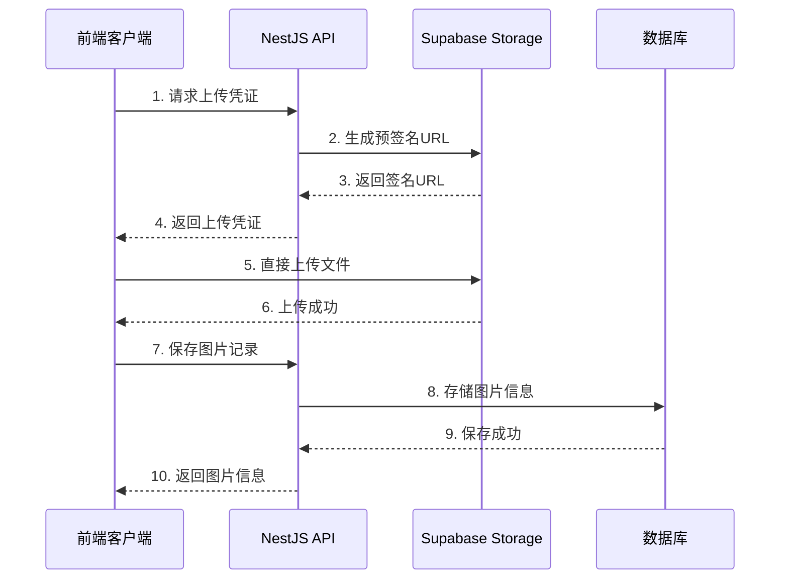

# Supabase 配置指南

## 概述

本项目使用 Supabase 作为对象存储服务，实现图片的上传和管理功能。本文档详细说明了如何配置和使用 Supabase 集成。

## 前置条件

1. **Supabase 账户**: 在 [supabase.com](https://supabase.com) 注册账户
2. **项目创建**: 在 Supabase 控制台创建新项目
3. **存储桶设置**: 创建用于存储图片的存储桶

## 配置步骤

### 1. 获取 Supabase 配置信息

在 Supabase 项目控制台中：

1. **项目 URL**: 
   - 位置：Settings > API > Project URL
   - 格式：`https://your-project-id.supabase.co`

2. **Service Key**:
   - 位置：Settings > API > Project API keys > service_role
   - ⚠️ **重要**: 这是服务端密钥，请妥善保管，不要暴露在客户端代码中

### 2. 创建存储桶

1. 进入 Storage 页面
2. 点击 "New bucket"
3. 输入桶名称（建议：`mall-dev` 用于开发，`mall-prod` 用于生产）
4. 设置为 Public bucket（允许公开访问图片）
5. 点击 "Create bucket"

### 3. 配置环境变量

在项目根目录的 `.env` 文件中添加：

```env
# Supabase 配置
SUPABASE_URL=https://your-project-id.supabase.co
SUPABASE_SERVICE_KEY=your-service-role-key
SUPABASE_BUCKET_NAME=mall-dev
```

### 4. 设置存储桶策略（可选）

如果需要更精细的权限控制，可以在 Storage > Policies 中设置 RLS 策略：

```sql
-- 允许所有人读取图片
CREATE POLICY "Public Access" ON storage.objects FOR SELECT USING (bucket_id = 'mall-dev');

-- 允许认证用户上传图片
CREATE POLICY "Authenticated Upload" ON storage.objects FOR INSERT WITH CHECK (bucket_id = 'mall-dev' AND auth.role() = 'authenticated');
```

## 测试配置

### 1. 运行连接测试

```bash
npm run test:supabase
```

这个命令会：
- ✅ 验证环境变量配置
- ✅ 测试 Supabase 连接
- ✅ 检查存储桶是否存在
- ✅ 测试预签名 URL 生成
- ✅ 测试公网 URL 生成

### 2. API 健康检查

启动应用后，可以调用健康检查接口：

```bash
curl -X POST http://localhost:3000/image/health \
  -H "Content-Type: application/json"
```

预期响应：
```json
{
  "code": 200,
  "message": "操作成功",
  "data": {
    "connected": true,
    "bucketExists": true
  }
}
```

## 使用示例

### 1. 获取上传凭证

```bash
curl -X POST http://localhost:3000/image/getUploadToken \
  -H "Content-Type: application/json" \
  -d '{
    "fileName": "test-image.png",
    "fileType": "image/png"
  }'
```

### 2. 上传文件到 Supabase

使用返回的 `signedUrl` 直接上传文件：

```bash
curl -X PUT "返回的signedUrl" \
  -H "Content-Type: image/png" \
  --data-binary @test-image.png
```

### 3. 保存图片记录

```bash
curl -X POST http://localhost:3000/image/create \
  -H "Content-Type: application/json" \
  -d '{
    "url": "生成的公网URL",
    "path": "images/timestamp_random.png",
    "name": "test-image.png",
    "size": 102400,
    "mimeType": "image/png"
  }'
```

## 架构说明

### 上传流程



### 优势

1. **减轻服务器负担**: 文件直传到 Supabase，不经过应用服务器
2. **提高上传速度**: 利用 Supabase 的 CDN 网络
3. **安全性**: 预签名 URL 有时效性，防止滥用
4. **可扩展性**: Supabase 自动处理存储扩展

## 故障排除

### 常见问题

1. **连接失败**
   - 检查 `SUPABASE_URL` 格式是否正确
   - 确认网络连接正常
   - 验证 Supabase 项目状态

2. **权限错误**
   - 确认使用的是 `service_role` 密钥
   - 检查存储桶的 RLS 策略设置
   - 验证密钥是否有存储权限

3. **存储桶不存在**
   - 在 Supabase 控制台创建对应的存储桶
   - 确认 `SUPABASE_BUCKET_NAME` 配置正确

4. **上传失败**
   - 检查文件大小是否超出限制
   - 验证文件类型是否被允许
   - 确认预签名 URL 是否过期

### 调试技巧

1. **启用详细日志**:
   ```env
   LOG_LEVEL=debug
   ```

2. **检查 Supabase 日志**:
   在 Supabase 控制台的 Logs 页面查看详细错误信息

3. **使用测试脚本**:
   ```bash
   npm run test:supabase
   ```

## 生产环境注意事项

1. **环境变量安全**:
   - 使用不同的存储桶名称区分环境
   - 确保生产环境的 Service Key 安全存储

2. **存储桶策略**:
   - 生产环境建议设置更严格的 RLS 策略
   - 限制上传文件的大小和类型

3. **监控和备份**:
   - 设置 Supabase 项目的监控告警
   - 定期备份重要的图片数据

4. **CDN 配置**:
   - 考虑配置自定义域名
   - 启用适当的缓存策略

## 相关链接

- [Supabase 官方文档](https://supabase.com/docs)
- [Supabase Storage 文档](https://supabase.com/docs/guides/storage)
- [Supabase JavaScript 客户端](https://supabase.com/docs/reference/javascript/introduction)